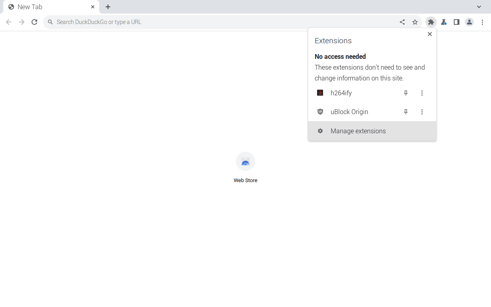
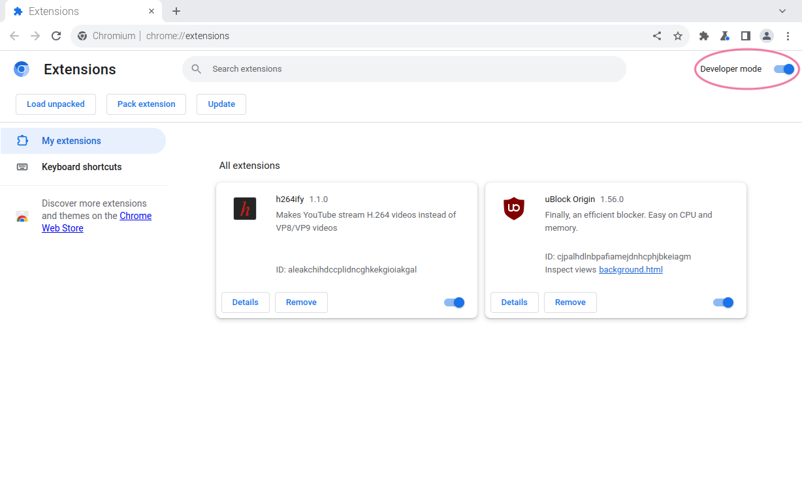
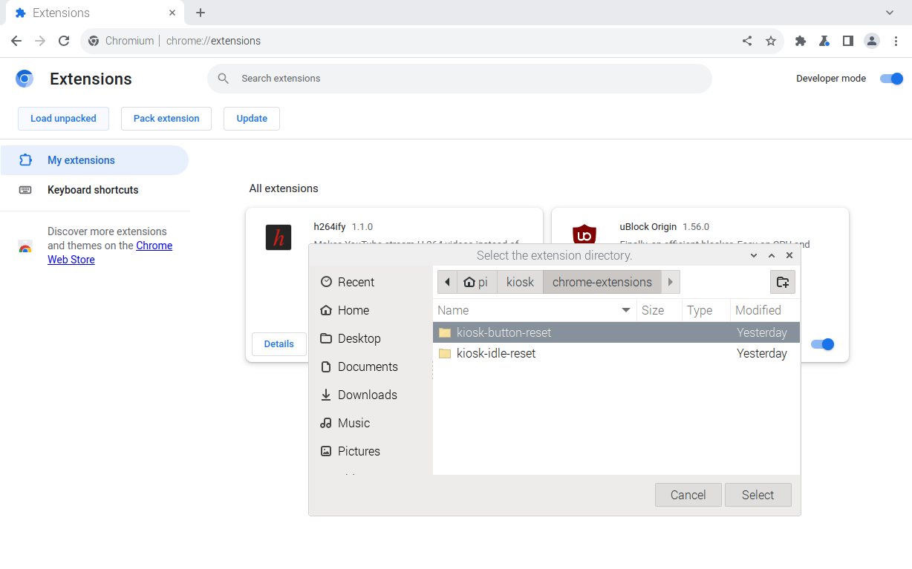
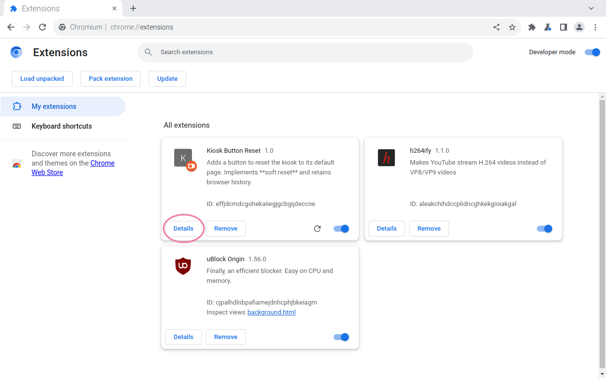
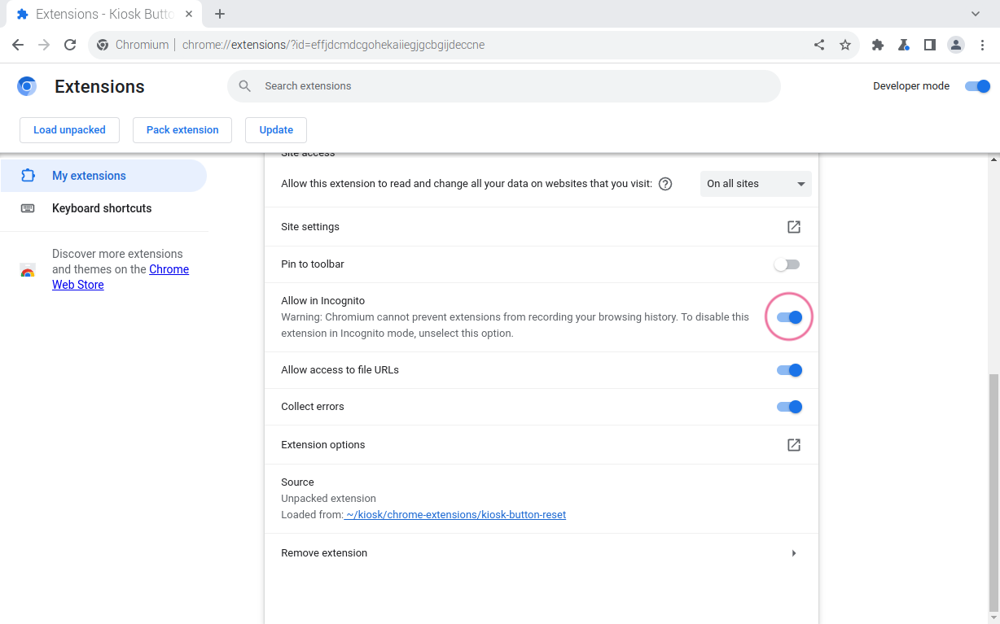
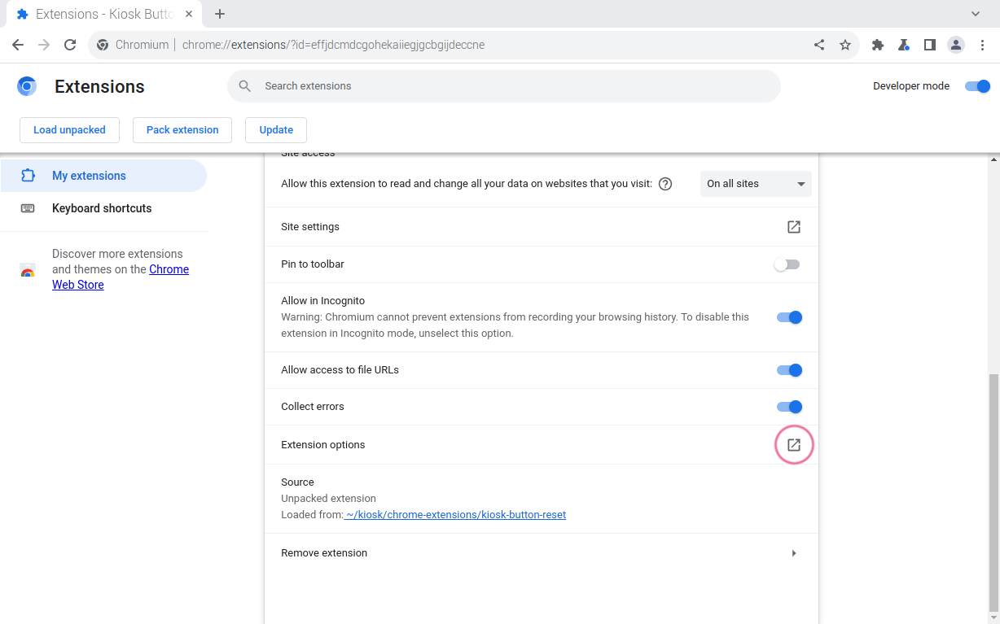
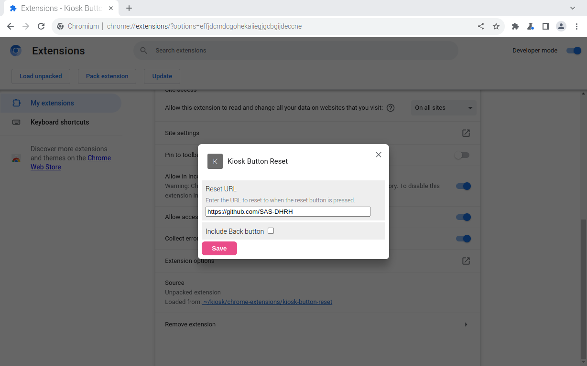
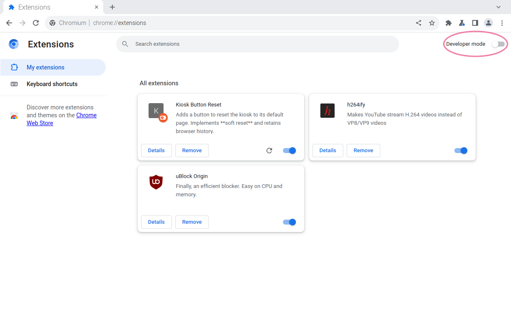
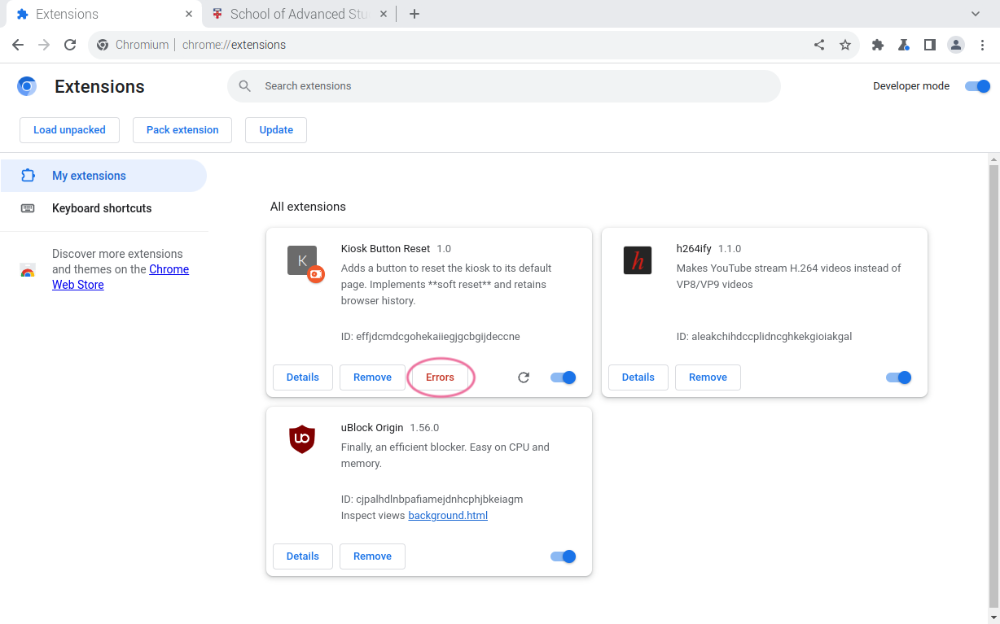
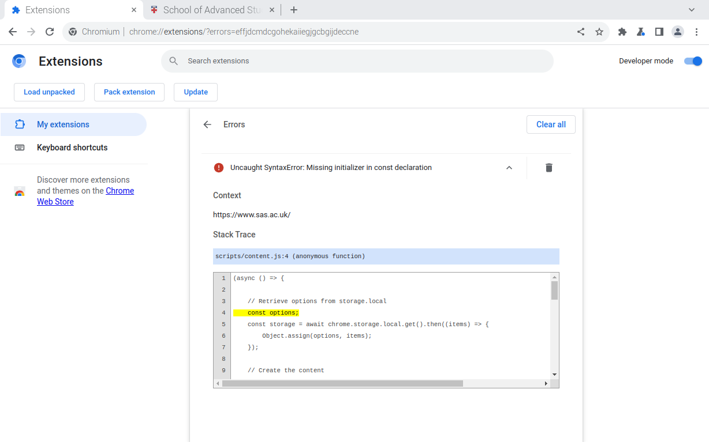

# Seized-Books (Cutbill) Project Kiosk


## Considerations

* The kiosk will display the project's exhibition website (Omeka S) in a single browser tab. No plan to have multiple tabs open and loop through those.
* The kiosk will operate with a touch screen, and without keyboard and mouse.
* The project's website contains both internal and external links, allowing kiosk users to navigate out of the website to another website e.g. Senate House Catalogue and potentially other websites that may not be relevant (or appropriate) to the project.
* The kiosk will be placed in a public place (e.g. bookshop) and unattended.
* The kiosk will be connected to a 'public' WiFi.
* Remote access via SSH/VNC is not available, so troubleshooting/debugging will be done on-site and likley in-situ.
* Kiosk-specific customization to the exhibition website may be possible but should not be assumed, as it is subject to factors such as the wider use of the website, web development resources, timetable, etc.

<br />

## Hardware

* Raspberry Pi 3B/3B+/4B
* Power supply for Raspberry Pi
* MicroSD card  (16GB or larger, U1/Class 10 recommended)
* Optionally, heatsink and/or fan for Raspberry Pi
* Display monitor
* Power supply for the display monitor
* HDMI cable for connecting Raspberry Pi to the display monitor

**Additionally for installation:**

* Another computer (Windows, Mac or Linux)
* MicroSD card reader
* USB Keyboard
* USB Mouse

**Additionally for system administration and troubleshooting/debugging:**

* USB Keyboard
* USB Mouse

<br />

## Installation

### 1. Prepare MicroSD card

1. Download and install [Raspberry Pi Imager](https://www.raspberrypi.com/software/) on your computer (not your Raspberry Pi).

1. Insert your MicroSD card into your computer (not your Raspberry Pi), using a MicroSD card reader.

1. Start up Raspberry Pi Imager, and configure it as follows and when you are done, click **NEXT**.

   **Raspberry Pi Device**: Select `NO FILTERING`.

   **Operating System**: Select `Raspberry Pi OS (other)` > `Raspberry Pi OS (64-bit)` (A port of Debian Bookworm with the Raspberry Pi Desktop)

   **Storage**: Select your MicroSD card.

1. In the **Use OS customisation?** prompt window, select **EDIT SETTINGS**.

1. In the **OS Customisation** window, configure the following settings, and when you are done, click **SAVE** to save your customisation settings and close the window.

   **GENERAL**

   - **Set hostname**: Enter a name for your Raspberry Pi. The name can be anything but should only contain alphabet, number and dash characters e.g. `kiosk`.

   * **Set username and password**

     * **Username**: Enter your choice of username e.g. `pi`.
     * **Password**: Enter your choice of password e.g. `letmein!23`.

     During OS installation, a user account will be created on your Raspberry Pi based on the information you provide here, and you will be using the username and password to log in to that user account on your Raspberry Pi.

   * **Configure wireless LAN**

     * **SSID**: Enter the name of your WiFi network/connection e.g. `UoL Conferences`.
     * **Password**: Enter the password for your WiFi network/connection. Leave blank if no password is required.
     * **Wireless LAN country**: Select the country code for the country for which your WiFi router is configured e.g. `GB`.

   * **Set locale settings**

     * **Time zone**:  Select the timezone you would like your Raspberry Pi to use e.g. `Europe/London`.
     * **Keyboard layout**: Select the keyboard layout appropriate to the keyboard you are using with your Raspberry Pi e.g. `gb`. 

   **SERVICES**

      * **Enable SSH**: Select this option.

      * **Use password authentication**: Select this option.

1. On returning to the **Use OS customisation?** window, select **YES** to applying your OS customisation settings.

1. Select **YES** to erasing all existing data on your MicroSD card. If Raspberry Pi Imager asks you for a password, enter the password you use to log into your computer (not the password you set for your Raspberry Pi).

1. Once Raspberry Pi Imager has finished flashing Raspberry Pi OS to your MicroSD card, eject the card from your computer. Raspberry Pi Imager is by default configured to eject media automatically - if you don't see your MicroSD card mounted on your Desktop or in Finder/File Explorer, you can simply remove it from your MicroSD card reader.

### 2. Install Raspberry Pi OS on Raspberry Pi

1. Insert your MicroSD card into your Raspberry Pi.
2. Connect your Raspberry Pi to a display monitor, keyboard and mouse.
3. Connect your Raspberry Pi to a power supply and boot it up.
4. Once your Raspberry Pi has completed booting up (this may take 3-5 minutes the first time around), you should be automatically logged in and see the Desktop.


### 3. Update Raspberry Pi OS

1. Open a terminal window.

1. Update the system package list.

   ```bash
   sudo apt update
   ```

1. Apply any available upgrades.

   ```bash
   sudo apt upgrade -y
   ```

1. Reboot your Raspberry Pi (optional, recommended).

   ```bash
   sudo reboot
   ```

### 4. Configure Raspberry Pi OS

1. Open a terminal window.

1. Start the **raspi-config Tool**.

   ```bash
   sudo raspi-config
   ```

   > :bulb:Navigation within the raspi-config Tool is by keyboard:
   >
   > * Up/Down/Left/Right keys to select options.
   > * Tab key to jump to and from options to actions (e.g. OK/Cancel/Back/Finish/Yes/No)
   > * Enter key to set or confirm your preferences.

1. Switch to using the X11/Openbox window manager instead of Wayland/Wayfire.

   1. Select **Advanced Options** and press the Enter key.
   1. Select **Wayland** and press the Enter key.
   1. Select **X11** and press the Enter key.
   1. Confirm **Openbox on X11 is active** by pressing the Enter key.
   1. Once back in the main menu, select **\<Finish>** and press the Enter key.
   1. When asked **Would you like to reboot now?**, select **\<Yes>** and press the Enter key.

1. Once your Raspberry Pi is booted, start the **raspi-config Tool** again.

   ```bash
   sudo raspi-config
   ```

1. Enable desktop autologin.

   1. Select **System Options** and press the Enter key.
   1. Select **Boot / Auto Login** and press the Enter key.
   1. Select **Desktop Autologin** and press the Enter key.

1. Disable display underscan (also referred to as 'overscan compensation').

   1. Select **Display Options** and press the Enter key.

   1. Select **Underscan** and press the Enter key.

   1. When asked **Would you like to enable overscan compensation for HDMI-1?**, select **\<No>** and press the Enter key.

   1. Confirm **Display overscan compensation for HDMI-1 is disabled** by pressing the Enter key.

1. Once back in the main menu, select **\<Finish>** and press the Enter key.

1. When asked **Would you like to reboot now?**, select **\<Yes>** and press the Enter key.

### 6. Set up kiosk script

1. Open a terminal window.

2. In your home directory, create a new folder and name it `kiosk`.

   ```bash
   mkdir $HOME/kiosk
   ```

   The command can be typed as you see it above, including `$HOME`, which is a shell variable that points to your home directory i.e. no need to type your home directory path manually.

3. Create a new file named `kiosk.sh` inside your `kiosk` directory, and open it with a terminal text editor.

   ```bash
   touch $HOME/kiosk/kiosk.sh && nano $HOME/kiosk/kiosk.sh
   ```

   The command can be typed as you see it above, including `$HOME`, which is a shell variable that points to your home directory i.e. no need to type your home directory path manually.

4. Add the following to the file. You can skip the comments and/or add your own.

   ```bash
   #!/bin/bash
   
   # Set kiosk URL
   KIOSK_URL="https://github.com/SAS-DHRH"
   
   # X Window System display settings
   xset -dpms      # turn off display power management
   xset s noblank  # turn off screen blanking
   xset s off      # turn off screen saver
   
   # Window settings
   # Get the width and height of available presentation space for the display monitor attached.
   GEOMETRY="$(fbset -s | awk '$1 == "geometry" { print $2":"$3 }')"
   WINDOW_WIDTH=$(echo "$GEOMETRY" | cut -d: -f1)
   WINDOW_HEIGHT=$(echo "$GEOMETRY" | cut -d: -f2)
   
   # Chromium settings
   # Prevent Chromium from throwing flags or pop-up warning bars upon error
   sed -i 's/"exited_cleanly":false/"exited_cleanly":true/' /home/$USER/.config/chromium/Default/Preferences
   sed -i 's/"exit_type":"Crashed"/"exit_type":"Normal"/' /home/$USER/.config/chromium/Default/Preferences
   
   # Launch Chromium
   chromium-browser $KIOSK_URL \
       --kiosk \
       --incognito \
       --start-fullscreen \
       --start-maximized \
       --window-position=0,0 \
       --window-size=$WINDOW_WIDTH,$WINDOW_HEIGHT \
       --no-default-browser-check \
       --noerrdialogs \
       --no-first-run \
       --disable-infobars \
       --disable-pinch \
       --disable-features=TranslateUI \
       --overscroll-history-navigation=0 \
       --disk-cache-dir=/dev/null \
       --check-for-update-interval=31536000
   ```

   `$KIOSK_URL`, `$WINDOW_WIDTH` and `$WINDOW_HEIGHT` should all be typed as they are.

   Adjust Chromium arguments as required, see [Run Chromium with command-line switches](https://www.chromium.org/developers/how-tos/run-chromium-with-flags/) and [List of Chromium command line switches](https://peter.sh/experiments/chromium-command-line-switches/).

5. Press the **Ctrl**+**X** keys, type **Y** to save the changes, and press the **Enter** key to confirm the file name to write and close the file.

6. Make the file executable.

   ```bash
   chmod u+x $HOME/kiosk/kiosk.sh
   ```

   The command can be typed as you see it above, including `$HOME`, which is a shell variable that points to your home directory i.e. no need to type your home directory path manually.

### 7. Set up kiosk service

We will run the kiosk script we created in the previous step as a service which will start automatically when your Raspberry Pi is booted up.

1. Open a terminal window.

2. Open the file named `/lib/systemd/system/kiosk.service` in a terminal text editor.

   ```bash
   sudo nano /lib/systemd/system/kiosk.service
   ```

   Don't worry if the file doesn't exist already, the command will still work and the file will be created when you save it.

3. Add the following to the file, replacing the placeholder `<username>` (including the brackets) with the username of your Raspberry Pi user account.

   ```bash
   [Unit]
   Description=Chromium Kiosk
   Wants=graphical.target
   After=graphical.target
   
   [Service]
   Type=simple
   Environment=DISPLAY=:0.0
   Environment=XAUTHORITY=/home/<username>/.XAuthority  # Replace the placeholder <username> with your username here.
   ExecStart=/bin/bash /home/<username>/kiosk/kiosk.sh  # Replace the placeholder <username> with your username here.
   Restart=on-abort
   User=<username>   # Replace the placeholder <username> with your username here.
   Group=<username>  # Replace the placeholder <username> with your username here.
   
   [Install]
   WantedBy=graphical.target
   ```

   If the username for your Raspberry Pi user account is `pi`, the content of the file would look like this:

   ```bash
   [Unit]
   Description=Chromium Kiosk
   Wants=graphical.target
   After=graphical.target
   
   [Service]
   Type=simple
   Environment=DISPLAY=:0.0
   Environment=XAUTHORITY=/home/pi/.XAuthority
   ExecStart=/bin/bash /home/pi/kiosk/kiosk.sh
   Restart=on-abort
   User=pi
   Group=pi
   
   [Install]
   WantedBy=graphical.target
   ```

4. Press the **Ctrl**+**X** keys, type **Y** to save the changes, and press the **Enter** key to confirm the file name to write and close the file.

5. Enable the kiosk service.

   ```bash
   sudo systemctl enable kiosk.service
   ```

### 8. Finally...

Reboot your Raspberry Pi.

```bash
sudo reboot
```

<br />

## Usage

### Exit kiosk mode

1. Press the **Ctrl+F4** keys. Some keyboards may also require the **Fn** key i.e. **Ctrl+Fn+F4**.

2. Open a terminal winow, and stop the kiosk service.

   ```bash
   sudo systemctl stop kiosk.service
   ```

### Re-enter kiosk mode

Open a terminal window, and either:

* Reboot your Raspberry Pi (recommended):

  ```bash
  sudo reboot
  ```

* Start the kiosk service without rebooting e.g. if you are debugging or testing any configuration changes you made:

  ```bash
  sudo systemctl start kiosk.service
  ```

### Change the kiosk URL

1. If the kiosk is running, exit kiosk mode and stop the kiosk service (see [Usage](#usage)).

2. If you have write-protection enabled for your MicroSD card, disable it (see [Security](#security)).

3. Open a terminal window and open the kiosk script in a terminal text editor.

   ```bash
   nano $HOME/kiosk/kiosk.sh
   ```

4. Update the following line, replacing the url value of the `KIOSK_URL` variable.

   ```bash
   # Set kiosk URL
   KIOSK_URL="https://github.com/SAS-DHRH"
   ```

5. Press the **Ctrl**+**X** keys, type **Y** to save the changes, and press the **Enter** key to confirm the file name to write and close the file.

6. If you have the Chrome extensions installed, update the reset URL via **Extention options** (see [Chrome extensions](#chrome-extensions)).

7. Reboot your Raspberry Pi.

   ```bash
   sudo reboot
   ```

8. If required, re-enable write-protection for your MicroSD card (see [Security](#security)).

### Manage the kiosk service

**Stop the service**

```bash
sudo systemctl stop kiosk.service
```

**Start the service**

```bash
sudo systemctl start kiosk.service
```

**Restart the service**

```bash
sudo systemctl restart kiosk.service
```

**Disable the service**

```bash
sudo systemctl disable kiosk.service
```

**Enable the service**

```bash
sudo systemctl enable kiosk.service
```

**Check the service status**

```bash
sudo systemctl status kiosk.service
```

**Check active status**

```bash
sudo systemctl is-active kiosk.service
```

**Check enabled status**

```bash
sudo systemctl is-enabled kiosk.service
```

**View the service log**

```bash
journalctl --unit=kiosk.service
```

### Remote access your Raspberry Pi via SSH

See [Raspberry Pi documentation on remote access](https://www.raspberrypi.com/documentation/computers/remote-access.html), and how-to for [Windows](https://www.raspberrypi.com/documentation/computers/remote-access.html#secure-shell-from-windows-10) or [Linux/Mac](https://www.raspberrypi.com/documentation/computers/remote-access.html#secure-shell-from-linux-or-mac-os).

<br />

## Chrome extensions

The following Chrome extensions can be downloaded from [SAS-DHRH/raspberry-pi GitHub repository](https://github.com/SAS-DHRH/raspberry-pi/tree/main/kiosk/chrome-extensions):

* [**kiosk-button-reset**](https://github.com/SAS-DHRH/raspberry-pi/raw/main/kiosk/chrome-extensions/kiosk-button-reset.zip): On-screen reset and back buttons. The reset button soft resets the kiosk to the default webpage, and the back button allows navigation back to previously viewed pages.
* [**kiosk-idle-reset**](https://github.com/SAS-DHRH/raspberry-pi/raw/main/kiosk/chrome-extensions/kiosk-idle-reset.zip): Automatically hard resets the kiosk to the default webpage after a specified period of idle time.

These extensions are provided 'as is'. Chrome extensions are built with JavaScript, CSS and HTML, and functionality and appearance of extensions can be modified and/or extended by editing the extension files.

### Installation

1. If the kiosk is running, exit kiosk mode and stop the kiosk service (see [Usage](#usage)).

2. If you have write-protection enabled for your MicroSD card, disable it (see [Security](#security)).

3. Download the extension(s).

   1. If it doesn't exist already, create a folder named `chrome-extensions` in your `kiosk` folder.

      ```bash
      mkdir $HOME/kiosk/chrome-extensions
      ```

      The command can be typed as you see it above, including `$HOME`, which is a shell variable that points to your home directory i.e. no need to type your home directory path manually.

   2. Download the extension.

      * kiosk-button-reset

        ```bash
        wget https://github.com/SAS-DHRH/raspberry-pi/raw/main/kiosk/chrome-extensions/kiosk-button-reset.zip -P $HOME/kiosk/chrome-extensions
        ```

      * kiosk-idle-reset

        ```bash
        wget https://github.com/SAS-DHRH/raspberry-pi/raw/main/kiosk/chrome-extensions/kiosk-idle-reset.zip -P $HOME/kiosk/chrome-extensions
        ```

   3. Unzip the extension.

      * kiosk-button-reset

        ```bash
        unzip $HOME/kiosk/chrome-extensions/kiosk-button-reset.zip -d $HOME/kiosk/chrome-extensions/kiosk-button-reset
        ```

      * kiosk-idle-reset

        ```bash
        unzip $HOME/kiosk/chrome-extensions/kiosk-idle-reset.zip -d $HOME/kiosk/chrome-extensions/kiosk-idle-reset
        ```

4. Open a Chromium window, and go to **Manage extensions** by typing into the address bar `chrome://extensions`, or by opening Extensions menu by clicking the puzzle button:

   <kbd></kbd>

5. Turn on **Developer mode**.

   <kbd></kbd>

6. Click on **Load unpacked**, and select the folder of the Chrome extension to install.

   <kbd></kbd>

7. Once the extension is loaded, click on **Details**.

   <kbd></kbd>

8. Scroll down to the bottom of the details page, and find **Allow in Incognito** setting and enable it.

   <kbd></kbd>

9. Click open **Extension options**.

   <kbd></kbd>

10. Configure the extension and **Save**.

   <kbd></kbd>

11. Click **My extensions** menu in the sidebar and return to **Extensions** home page.

12. Repeat steps 4-9 to install other extensions as needed.

13. Once all the exntesions are installed, turn off **Developer mode**.

    <kbd></kbd>

14. Open a terminal window and reboot your Raspberry Pi.

    ```bash
    sudo reboot
    ```

15. If required, re-enable write-protection for your MicroSD card (see [Security](#security)).

### Notes

#### kiosk-button-reset

* The extension implements 'soft' reset - a reset simply navigates to a specified webpage in the existing tab and thus retains browsing history.

#### kiosk-idle-reset

* The extention uses Chrome Idle Detection API to detect when the kiosk's state changes to 'idle' state. The change happens when there is no interaction with the screen, mouse or keyboard for a specified time (the default is 60 seconds).
* The extension implements 'hard' reset - a reset opens a new tab and replaces the old tab, and therefore does not retain browsing history.
* The automatic reset takes effect only when a specified period has lapsed since the last user activity. This means that if the kiosk continues to remain in 'idle' state after a reset, the automatic reset will not be triggered again. Only when a subsequent user activity changes the kiosk's state back to 'active' state, a change to 'idle' state can happen and trigger the automatic reset.
* Chrome idle time detection respects active slideshow, audio and video content. If the kiosk is displaying a webpage containing such content, the automatic reset may not take effect and require a manual trigger.

<br />

## Auto-shutdown/startup

Raspberry Pi relies on power supply to startup. In order for Raspberry Pi to startup, it first needs its power supply to be turned off and then turned back on again. Automating shutdown and startup therefore takes a combination of:

* Cron job (a task automated using a scheduler tool called `cron`) to perform a software shutdown, so that the power supply can be safely switched off; and 
* A timer plug/switch to turn the power supply off and on.

### Installation

1. If the kiosk is running, exit kiosk mode and stop the kiosk service (see [Usage](#usage)).

2. If you have write-protection enabled for your MicroSD card, disable it (see [Security](#security)).

3. Open the `crontab` file.

   ```bash
   sudo crontab -e
   ```

   When you run this command for the first time, you will be prompted to select a editor. Unless you have a preference, select `/bin/nano`.

4. Add the following at the bottom of the file, adjusting the time as appropriate. The time should be supplied in the **hh:mm** format, and as 24-hour time e.g. 6am would be `06:00`, while 6pm would be `18:00`.

   ```bash
   @reboot /sbin/shutdown -h 18:00
   ```

5. Press the **Ctrl**+**X** keys, type **Y** to save the changes, and press the **Enter** key to confirm the file name to write and close the file.

6. Reboot your Raspberry Pi.

   ```bash
   sudo reboot
   ```

7. Set the timer plug/switch to turn the power supply off 10 minutes or so after your Raspberry Pi's shutdown time, and to turn it on again at your desired time.

8. If required, re-enable write-protection for your MicroSD card (see [Security](#security)).

<br />

## Security

### Disable/enable Ports

#### Ethernet port

##### Disable the Ethernet port

```bash
sudo ifconfig eth0 down
```

##### Enable the Ethernet port

```bash
sudo ifconfig eth0 up
```

##### Note:

The disable command is temporary and the Ethernet port will be enabled again after the next reboot. To automatically disable the Ethernet port at startup:

1. Open the `/etc/rc.local` file in a terminal text editor.

2. Add the following lines above the line `exit 0`.

   ```bash
   # Disable the Ethernet port
   sudo ifconfig eth0 down
   ```

3. Press the **Ctrl**+**X** keys, type **Y** to save the changes, and press the **Enter** key to confirm the file name to write and close the file.

#### USB ports

Due to the limitation of Raspberry Pi hardware design, USB ports cannot be disabled individually (to do so, requires additional hardware and software). Where access via SSH/VNC is not available, seek an alternative solution to prevent physical access to USB ports e.g. place the Raspberry Pi in a locked case/cupboard.

##### Disable the USB ports

```bash
echo '1-1' | sudo tee /sys/bus/usb/drivers/usb/unbind
```

##### Enable the USB ports

```bash
echo '1-1' | sudo tee /sys/bus/usb/drivers/usb/bind
```

##### Note:

The disable command is temporary and the USB ports will be enabled again after the next reboot. To automatically disable the USB ports at startup:

1. Open the `/etc/rc.local` file in a terminal text editor.

2. Add the following lines above the line `exit 0`.

   ```bash
   # Disable the USB ports
   echo '1-1' | sudo tee /sys/bus/usb/drivers/usb/unbind
   ```

3. Press the **Ctrl**+**X** keys, type **Y** to save the changes, and press the **Enter** key to confirm the file name to write and close the file.

### Disable/enable Bluetooth

##### Disable Bluetooth

1. Open the `/boot/firmware/config.txt` file in a terminal text editor.

2. Add the following lines to the bottom of the file.

   ```bash
   # Disable Bluetooth
   dtoverlay=disable-bt
   ```

3. Press the **Ctrl**+**X** keys, type **Y** to save the changes, and press the **Enter** key to confirm the file name to write and close the file.

4. Reboot your Raspberry Pi.

   ```bash
   sudo reboot
   ```

##### Enable Bluetooth

1. Open the `/boot/firmware/config.txt` file in a terminal text editor.

2. Remove the following lines at/near the bottom of the file.

   ```bash
   # Disable Bluetooth
   dtoverlay=disable-bt
   ```

3. Press the **Ctrl**+**X** keys, type **Y** to save the changes, and press the **Enter** key to confirm the file name to write and close the file.

4. Reboot your Raspberry Pi.

   ```bash
   sudo reboot
   ```

### Enable/disable write-protection for SD card

##### Enable write-protection (make SD card read-only)

1. Start the **raspi-config Tool**.

   ```bash
   sudo raspi-config
   ```

   > :bulb:Navigation within the raspi-config Tool is by keyboard:
   >
   > * Up/Down/Left/Right keys to select options.
   > * Tab key to jump to and from options to actions (e.g. OK/Cancel/Back/Finish/Yes/No)
   > * Enter key to set or confirm your preferences.

1. Select **Performance Options** and press the Enter key.

1. Select **Overlay File System** and press the Enter key.

1. When asked **Would you like the overlay file system to be enabled?**, select **\<Yes>** and press the Enter key.

1. Confirm **The overlay file system is enabled** by pressing the Enter key.

1. When asked **Would you like the boot partition to be write-protected?**, select **\<Yes>** and press the Enter key.

1. Confirm **The boot partition is read-only** by pressing the Enter key.

1. Once back in the main menu, select **\<Finish>** and press the Enter key.

1. When asked **Would you like to reboot now?**, select **\<Yes>** and press the Enter key.

##### Disable write-protection (make SD card writable)

1. Start the **raspi-config Tool**.

   ```bash
   sudo raspi-config
   ```

   > :bulb:Navigation within the raspi-config Tool is by keyboard:
   >
   > * Up/Down/Left/Right keys to select options.
   > * Tab key to jump to and from options to actions (e.g. OK/Cancel/Back/Finish/Yes/No)
   > * Enter key to set or confirm your preferences.

1. Select **Performance Options** and press the Enter key.

1. Select **Overlay File System** and press the Enter key.

1. When asked **Would you like the overlay file system to be enabled?**, select **\<No>** and press the Enter key.

1. Confirm **The overlay file system is disabled** by pressing the Enter key.

1. Confirm **The boot partition is currently read-only. This cannot be cnahged while an overlay file system is enabled** by pressing the Enter key.

1. Once back in the main menu, select **\<Finish>** and press the Enter key.

1. When asked **Would you like to reboot now?**, select **\<Yes>** and press the Enter key.

1. Once rebooted, start the **raspi-config Tool** again.

   ```bash
   sudo raspi-config
   ```

1. Select **Performance Options** and press the Enter key.

1. Select **Overlay File System** and press the Enter key.

1. When asked **Would you like the overlay file system to be enabled?**, select **\<No>** and press the Enter key.

1. Confirm **The overlay file system is disabled** by pressing the Enter key.

1. When asked **Would you like the boot partition to be write-protected?**, select **\<No>** and press the Enter key.

1. Confirm **The boot partition is writable** by pressing the Enter key.

1. Once back in the main menu, select **\<Finish>** and press the Enter key.

1. When asked **Would you like to reboot now?**, select **\<Yes>** and press the Enter key.

<br />

## Troubleshooting/debugging

### Basic steps

1. If the kiosk is running, exit kiosk mode and stop the kiosk service (see [Usage](#usage)).

2. If you have write-protection enabled for your MicroSD card, disable it (see [Security](#security)).

3. Troubleshoot/Debug.

   * Identify the problem. What is not working? Is it the kiosk itself (e.g. the kiosk is not starting up, has crashed/frozen, etc) or its functionality (e.g. the kiosk is not resetting)?
   * Identify the root cause. What is causing the problem and where? If it is the kiosk itself that is not working, check for errors in the kiosk service log. If it is a functionality, check for errors in Chrome extension.
   * Rectify the problem. If there are any errors found in the kiosk service log or Chrome extension, address and fix those. Otherwise, try rebooting and trace back the steps that has/could have resulted in the problem.

4. Start the kiosk service (see [Usage](#usage)).

5. Test and verify that the problem has been resolved.

6. If all looks good, reboot your Raspberry Pi.

   ```bash
   sudo reboot
   ```

7. If required, re-enable write-protection for your MicroSD card (see [Security](#security)).


### Kiosk service log

1. Open a new terminal window. This is separately and in addition to the terminal window you are working in.

2. Display the most recent entries in the kiosk service log into the window, using the 'follow' option so that it continues to print new log entries as you debug.

   ```bash
   journalctl --unit=kiosk.service --follow
   ```


### Chrome extension errors

1. Open a Chromium window, and go to **Manage extensions** by typing into the address bar `chrome://extensions`, or by opening Extensions menu by clicking the puzzle button:

   <kbd></kbd>

2. Turn on **Developer mode**.

   <kbd></kbd>

3. Open a new tab and go to any webpage.

4. Return to **Manage extensions**, and if there are any errors, you will see flagged up like this:

   <kbd></kbd>

5. Click **Errors** to see the details.

   <kbd></kbd>

<br /><br />

\---

Michael Donnay and Kunika Kono, [Digital Humanities Research Hub (DHRH)](https://www.sas.ac.uk/digital-humanities), School of Advanced Study (SAS), University of London.  

:octocat: Find us on GitHub at https://github.com/SAS-DHRH
