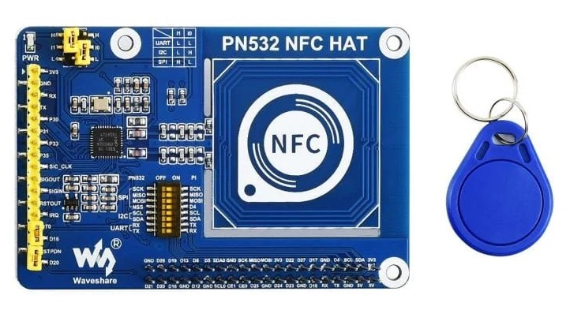
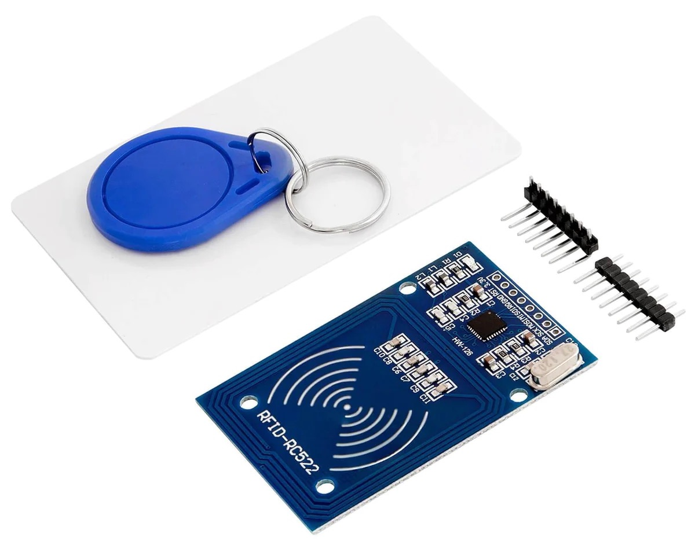
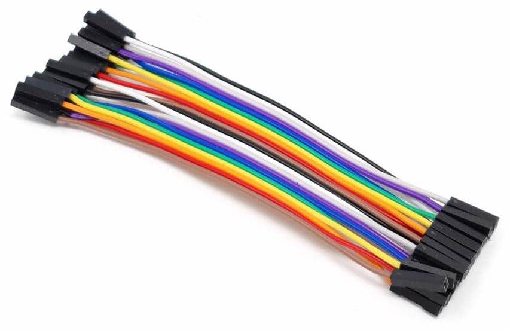

# Museum in a Box

Inspired by [Museum in a Box](https://museuminabox.org), we will be building a version from scratch, keeping with the core idea - triggering and playing audio on Raspberry Pi via RFID - while leaving plenty of room to w(o|a)nder and transform the box. There are lots of ideas out in the wild: [jukebox](https://www.youtube.com/watch?v=5Y1Psf6igHE), [audiobook player](https://www.youtube.com/watch?v=-lAeRB1GZUo), [minature theatre](https://www.youtube.com/watch?v=sFYVwn0VhLk) or [music festival](https://vimeo.com/466007950), or how about an adaptation of this [immersive exhibition](https://www.youtube.com/watch?v=A9H5b_BZWwo)? 

Raspberry Pi’s, modules, cables and tools required for this project are all available to use and share in the MakerSpace, but feel free to bring your own if you would like to build this project to take away with you (see the [ingredients section](#ingredients) below).

 

## Prerequisites 

Curiosity and enthusiasm. No prior experience of Raspberry Pi, command line, programming or 3D printing is required, we’ll be learning these along the way.

 

## Tasks

* Install and configure Raspberry Pi OS. 
* Install NFC/RFID module on Raspberry Pi. 
* Install and configure [Phoniebox/RPi-Jukebox-RFID](https://github.com/MiczFlor/RPi-Jukebox-RFID).
* Create audio recordings. 
* Stick NFC stickers on things.
* Make things speak/play sounds.
* Optional: 3D design, model and print a box for Raspberry Pi. 
* Optional: Build volume and/or forward/rewind controls.

 

## Ingredients

### 1. Raspberry Pi 

- Raspberry Pi 3B+/4B or Zero W/2W ([check availability](https://rpilocator.com/?country=UK))
- Power supply for Raspberry Pi
- MicroSD card (32GB or larger, U1/C10 or above)
- Speaker (3.5mm AUX input or Bluetooth)
- Optionally, heatsink and/or fan

For installation and configuration of operating system and software, you will also need:

- Linux, Mac or Windows computer
- MicroSD card reader/writer
- Display monitor
- USB Keyboard.

If you are using Raspberry Pi Zero W/2W, you will additionally need:

* A 40-pin male header soldered or attached (e.g. [solderless hammer header](https://shop.pimoroni.com/products/gpio-hammer-header?variant=35643241098)).
* Optionally, a MicroUSB-to-USB adapter for connecting a keyboard to your Raspberry Pi.

### 2. NFC/RFID module

We will be using a module that operates on 13.56MHz frequency e.g.:

<b>Waveshare PN532 NFC HAT for Raspberry Pi</b>, around £18. Plug-and-play, no soldering nor extras required.

 

<b>RFID RC522 module</b>, around £5. Requires header pin soldering and 8 noodles of socket-to-socket (also referred to as F/F or female-to-female) jumper wires to connect to Raspberry Pi

### 3. NFC stickers

We will be using NFC stickers with the following specifications: 
* Operating frequency: 13.56 MHz
* Chip: NTAG213 or NTAG215 or NTAG216

:warning: Make sure the operating frequency of the NFC/RFID module and that of NFC stickers are the same.

As we will only be using the chip UID (manufacturer supplied read-only unique identifier), the NTAG213 chip should be sufficient for this project, but if you intend to store additional data, you may need higher memory capacity:

| Chip    | Memory (total/available) | URL length     | Text length    |
| ------  | ------------------------ | -------------- | -------------- |
| NTAG213 | 180/144 bytes            | 132 characters | 130 characters |
| NTAG215 | 540/504 bytes            | 492 characters | 490 characters | 
| NTAG216 | 924/888 bytes            | 854 characters | 852 characters |

**URL length**: The maximum number of characters that a link can contain, excluding the `https://www.` part.
**Text length**: The maximum number of characters that you can write.

### 4. Extras

* 8 x socket-to-socket jumper wires (if using the RFID RC522 module)
* Switches and potentiometers (optional)
* Breadboard and jumper wires for wiring up switches and potentiometers (optional).

### 5. Tools

* Tweezers for pulling in/out MicroSD card into Raspberry Pi and/or SD card reader/writer.
* Soldering iron, solder, flux, desoldering wick, soldering mat, iron stand and tip cleaner, cutters, PPE e.g. gloves, mask, goggles. Optionally: tips and bits, desoldering pump/solder sucker.

 

## Recipe

1. [Install Raspberry Pi OS](docs/Raspberry-Pi-OS.md)
2. Install RFID Reader module:
   * [Waveshare PN532 NFC HAT](docs/Waveshare-PN532-NFC-HAT.md)
   * [RFID RC522](docs/RC522-RFID.md)
3. [Install Phoniebox](docs/Phoniebox.md)
4. [Set up Bluetooth speaker](docs/Bluetooth.md)
5. [Test system audio output](docs/Audio.md)
6. [Add audio to Phoniebox audio library](docs/Phoniebox.md#adding-audio-files-to-phoniebox)
   - [Samba](docs/Phoniebox.md#samba)
   - [SSH](docs/Phoniebox.md#ssh)

 

## Gallery

To be added...

  

\---

Michael Donnay and Kunika Kono, [Digital Humanities Research Hub (DHRH)](https://www.sas.ac.uk/digital-humanities), School of Advanced Study (SAS), University of London.  

:octocat: Find us on GitHub at https://github.com/SAS-DHRH
