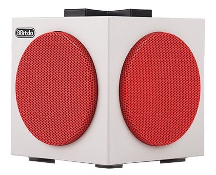

# Bluetooth

Connecting Bluetooth devices to Raspberry Pi takes 3-part process:

1. **Pairing** authorizes a Bluetooth device to connect to your Raspberry Pi and this authorization is saved/remembered, so when the device is in range, it will be automatically paired to your Raspberry Pi.
2. **Trusting** registers a divice as 'trusted (by you)', and allows you to connect a Bluetooth device without any need for a password or pincode.
3. **Connecting** activates a Bluetooth device for communication with your Raspberry Pi.

<br />

## Preparation

Before connecting a Bluetooth device with Raspberry Pi or troubleshoot Bluetooth issues, make sure that you perform the following preparatory checks (recommended even if you have done so previously): 

- [ ] Check your user account is in the `bluetooth` group.
- [ ] Check the bluetooth service is enabled and running.
- [ ] Check the bluetooth controller service `hciuart` is enabled and running. Note: This applies only if you are running Raspberry Pi OS version **bullseye**. If you are running **bookworm**, you can skip this check.

### Check your user account is in the `bluetooth` group

1. List all the groups to which your user account belongs.

   ```bash
   groups
   ```

   The command will output a list of groups like this:

   ```bash
   pi adm dialout cdrom sudo audio video plugdev games users input render netdev gpio i2c spi
   ```

   If the list includes  `bluetooth`, then your user account is already in the `bluetooth` user group.

   If the list does not include `bluetooth` , follow the rest of the steps and add your account to the `bluetooth` user group.

2. Add your user account to the `bluetooth` user group.

   ```bash
   sudo usermod -aG bluetooth $USER
   ```

3. Verify that your user account has been successfully added to the `bluetooth` group.

   ```bash
   getent group | grep bluetooth
   ```

   The command will output the users who are in the group as a colon-delimited list like this:

   ```bash
   bluetooth:x:112:pi
   ```

   You should find your username included in the list e.g. `pi`. If not, try adding your user account to the group again by running the command in the previous step.

4. Log your account in to the `bluetooth` user group.

   ```bash
   newgrp bluetooth
   ```

   Now if you list all the groups to which your user account belongs:

   ```bash
   groups
   ```
   
   You should find `bluetooth` included in the output like this:
   
   ```bash
   bluetooth adm dialout cdrom sudo audio video plugdev games users input render netdev spi i2c gpio pi
   ```

### Check the bluetooth service is running

1. Check if the bluetooth service is enabled.

   ```bash
   systemctl is-enabled bluetooth
   ```

   The command will output `enabled` or `disabled`.

   If the output is `disabled`, run the following command and enable the service:

   ```bash
   sudo systemctl enable bluetooth
   ```

2. Check if the bluetooth service is active.

   ```bash
   systemctl is-active bluetooth
   ```

   The command will output `active` or `inactive`.

    If the output is `inactive`, run the following command and activate/start the service:
   
   ```bash
   sudo systemctl start bluetooth
   ```

### Check the bluetooth controller `hciuart` is running 

1. Check if the bluetooth service is enabled.

   ```bash
   systemctl is-enabled hciuart
   ```

   The command will output `enabled` or `disabled`

   If the output is `disabled`, run the following command and enable the service:

   ```bash
   sudo systemctl enable hciuart
   ```

2. Check if the bluetooth service is active.

   ```bash
   systemctl is-active hciuart
   ```

   The command will output `active` or `inactive`.

   If the output is `inactive`, run the following command and activate/start the service:
   
   ```bash
   sudo systemctl start hciuart
   ```

<br />

## Connecting a Bluetooth device to Raspberry Pi

For the steps in this section, we'll be using 8bitdo Cube Speaker as an example Bluetooth device:


<p>Example speaker: 8bitdo Cube Speaker</p>

1. Turn on your bluetooth device and put it into pairing mode.

2. Run `bluetoothctl`.

   ```bash
   sudo bluetoothctl
   ```

3. Turn on device discovery mode.

   ```bash
   scan on
   ```

   The  will print a list of available Bluetooth devices, added as they are discovered:

   ```bash
   [CHG] Controller B8:27:EB:A8:27:1D Discovering: yes
   [NEW] Device 78:FD:CB:79:04:D8 78-FD-CB-79-04-D8
   [NEW] Device 4A:36:3D:5C:26:5B 4A-36-3D-5C-26-5B
   ...
   [NEW] Device F4:4E:FD:8C:AA:E2 8Bitdo Cube          <-- e.g. this is the example speaker.
   ```

   It may take a couple of minutes for your Raspberry Pi to discover your Bluetooth device.

4. Once your Bluetooth device is discovered, make a note of its 48-bit MAC address (e.g. F4:4E:FD:8C:AA:E2), and turn off device discovery mode.

   ```bash
   scan off
   ```

5. Pair your Bluetooth device, replacing the example MAC address with that of your device in the command.

   ```bash
   pair F4:4E:FD:8C:AA:E2
   ```

   The command will output a response like this:

   ```bash
   Attempting to pair with F4:4E:FD:8C:AA:E2
   [CHG] Device F4:4E:FD:8C:AA:E2 Connected: yes
   [CHG] Device F4:4E:FD:8C:AA:E2 Bonded: yes
   [CHG] Device F4:4E:FD:8C:AA:E2 UUIDs: 0000110b-0000-1000-8000-00805f9b34fb
   [CHG] Device F4:4E:FD:8C:AA:E2 UUIDs: 0000110c-0000-1000-8000-00805f9b34fb
   [CHG] Device F4:4E:FD:8C:AA:E2 UUIDs: 0000110e-0000-1000-8000-00805f9b34fb
   [CHG] Device F4:4E:FD:8C:AA:E2 UUIDs: 0000111e-0000-1000-8000-00805f9b34fb
   [CHG] Device F4:4E:FD:8C:AA:E2 ServicesResolved: yes
   [CHG] Device F4:4E:FD:8C:AA:E2 Paired: yes
   Pairing successful
   [CHG] Device F4:4E:FD:8C:AA:E2 ServicesResolved: no
   [CHG] Device F4:4E:FD:8C:AA:E2 Connected: no
   ```

   Make sure that your output includes the line `Pairing successful`. If it doesn't, turn your Bluetooth device off and on again, and repeat the steps 2-5.

6. Trust your Bluetooth device, replacing the example MAC address with that of your device in the command.

   ```bash
   trust F4:4E:FD:8C:AA:E2
   ```

   This command will output a response like this:

   ```bash
   [CHG] Device F4:4E:FD:8C:AA:E2 Trusted: yes
   Changing F4:4E:FD:8C:AA:E2 trust succeeded
   ```

7. Connect to your Bluetooth device, replacing the example MAC address with that of your device in the command.

   ```bash
   connect F4:4E:FD:8C:AA:E2
   ```

   This command will output a response like this:

   ```bash
   Attempting to connect to F4:4E:FD:8C:AA:E2
   [CHG] Device F4:4E:FD:8C:AA:E2 Connected: yes
   [NEW] Endpoint /org/bluez/hci0/dev_F4_4E_FD_8C_AA_E2/sep1
   [NEW] Transport /org/bluez/hci0/dev_F4_4E_FD_8C_AA_E2/sep1/fd0
   Connection successful
   [CHG] Transport /org/bluez/hci0/dev_F4_4E_FD_8C_AA_E2/sep1/fd0 State: active
   [CHG] Device F4:4E:FD:8C:AA:E2 ServicesResolved: yes
   [CHG] Transport /org/bluez/hci0/dev_F4_4E_FD_8C_AA_E2/sep1/fd0 Volume: 0x007f (127)
   [CHG] Transport /org/bluez/hci0/dev_F4_4E_FD_8C_AA_E2/sep1/fd0 State: idle
   ```

   Make sure that your output includes the line `Connection successful`.

8. Exit `bluetoothctl`.

   ```bash
   exit
   ```

9. Check your Bluetooth device has successfully paired with and connected to your Raspberry Pi (see below).

<br />

## Checking pairing and connection of your bluetooth device

1. Check the version of `bluetoothctl` installed on your Raspberry Pi.

   ```bash
   bluetoothctl --version
   ```

   This command will output the version like this:

   ```bash
   bluetoothctl: 5.66
   ```

2. Check your Bluetooth device is paired with your raspberry Pi.

   - If your `bluetoothctl` version is or newer than version 5.65 (>= 5.65):

     ```bash
     bluetoothctl devices Paired
     ```

   - If your `bluetoothctl` version is older than version 5.65 (< 5.65):

     ```bash
     bluetoothctl paired-devices
     ```
   
   These commands will output a list of Bluetooth devices paired with your Raspberry Pi. To check if a specific device is connected, make a note of the MAC address of that device (e.g. F4:4E:FD:8C:AA:E2).

3. Check your Bluetooth device is connected to your Raspberry Pi.

   ```bash
   bluetoothctl info F4:4E:FD:8C:AA:E2
   ```

   The command will output the details of your device, including the connection status, like this:

   ```bash
   Device F4:4E:FD:8C:AA:E2 (public)
   Name: 8Bitdo Cube
   Alias: 8Bitdo Cube
   Class: 0x00240404
   Icon: audio-headset
   Paired: yes
   Bonded: yes
   Trusted: yes
   Blocked: no
   Connected: yes
   LegacyPairing: no
   UUID: Audio Sink (0000110b-0000-1000-8000-00805f9b34fb)
   UUID: A/V Remote Control Target (0000110c-0000-1000-8000-00805f9b34fb)
   UUID: A/V Remote Control (0000110e-0000-1000-8000-00805f9b34fb)
   UUID: Handsfree (0000111e-0000-1000-8000-00805f9b34fb)
   ```

<br /><br />

\---

Michael Donnay and Kunika Kono, [Digital Humanities Research Hub (DHRH)](https://www.sas.ac.uk/digital-humanities), School of Advanced Study (SAS), University of London.  

:octocat: Find us on GitHub at https://github.com/SAS-DHRH
