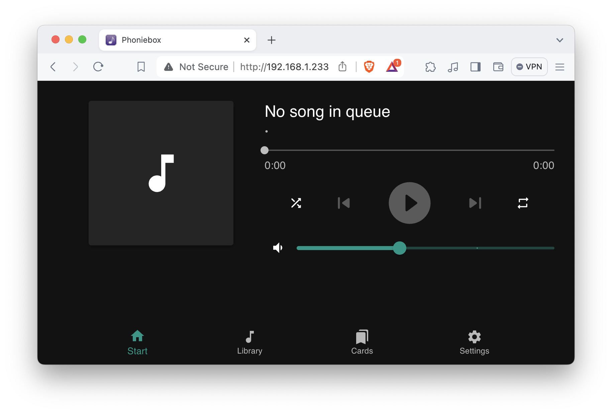

# Phoniebox

Phoniebox (also referred to as RPi-Jukebox-RFID) is a contactless jukebox for the Raspberry Pi, playing audio files, playlists, podcasts, web streams and spotify triggered by RFID cards.

Github: https://github.com/MiczFlor/RPi-Jukebox-RFID

<br />

The installation process consists of the following parts:

1. Pre-installation preparation
2. Installation

<br />

## Preparation

Installation of Phoniebox (future3 version) requires a couple of preparatory steps, and whether you need to take both or either of these steps depend on **the model of your Raspberry Pi** and **the version of Raspberry Pi OS running on your Raspberry Pi**.

Before proceeding with the preparatory steps, run the following two commands on your Raspberry Pi and make a note of the output of each:

-  **The model of your Raspberry Pi**

  ```bash
  cat /sys/firmware/devicetree/base/model
  ```

  The command will output the model information of your Raspberry Pi like this:

  ```bash
  Raspberry Pi 4 Model B Rev 1.5
  ```

  Make a note of the part preceding the revision information, which in the above example is 'Raspberry Pi 4 Model B'.

- **The version of Raspberry Pi OS running on your Raspberry Pi**

  ```bash
  lsb_release -a
  ```

  The command will output the details of the OS running on your Raspberry Pi like this:

  ```bash
  No LSB modules are available.
  Distributor ID:	Raspbian
  Description:	Raspbian GNU/Linux 12 (bookworm)
  Release:	12
  Codename:	bookworm
  ```

  Make a note of the codename, which in the above example is 'bookworm'.

### 1. Switch the kernel to run in 32-bit mode

[Phoniebox documentation](https://github.com/MiczFlor/RPi-Jukebox-RFID/blob/future3/main/documentation/builders/installation.md#workaround-for-64-bit-kernels-pi-4-and-newer) notes:

> The Phoniebox installation process checks if a 32-bit OS is running, as 64-bit is currently not supported. This check also fails if the kernel is running in 64-bit mode. This is the default for Raspberry Pi models 4 and newer.

#### What does this mean?

Phoniebox currently supports only the 32-bit systems, and it expects both of the following requirements to be satisfied:

1. that you have a 32-bit version of Raspberry Pi OS installed on your Raspberry Pi; and 
2. your Raspberry Pi is running in 32-bit mode.

#### Does this apply to me?

If you have followed the [Raspberry Pi OS installation guide](./Raspberry-Pi-OS.md), you would have installed a 32-bit version of Raspberry Pi OS and should thus satisfy the first requirement.

Whether you satisfy the second requirement depends on the model of your Raspberry Pi:

- If you are using **Raspberry Pi 4 Model B/400** or **Raspberry Pi 5**, the kernel is running in 64-bit mode by default and thus does not (yet) satisfy the second requirement. **You need to switch your Raspberry Pi to run in 32-bit mode**.
- If you are using **Raspberry Pi 3 B/A+/B+** or **Raspberry Pi Zero W/2W**, the kernel is running in 32-bit mode by default and thus satisfy the second requirement. **You do not need to do anything**.

#### How do I switch my Raspberry Pi to run in 32-bit mode?

1. Open the boot configuration file in a terminal-based text editor.

   - If the version of Raspberry Pi OS running on your Raspberry Pi is **bookworm**:

     ```bash
     sudo nano /boot/firmware/config.txt
     ```

   - If the version of Raspberry Pi OS running on your Raspberry Pi is **bullseye**:

     ```bash
     sudo nano /boot/config.txt
     ```

2. Press **Ctrl+V** keys together, as many time as needed to scroll to the end of the file, and add the following lines:

   ```bash
   [pi4]
   arm_64bit=0
   
   [all]
   
   ```

3. Press the **Ctrl+X** keys to exit nano (the command line text editor), then type **Y** to save changes, and press the **Enter** key to confirm the file name to write and close the file.

6. Reboot your Raspberry Pi.

   ```bash
   sudo reboot
   ```

### 2. Switch the network manager from `dhcpcd` to `NetworkManager`

[Phoniebox documentation](https://github.com/MiczFlor/RPi-Jukebox-RFID/blob/future3/develop/documentation/builders/installation.md#network-management-since-bookworm) notes:

> With Bookworm, network management has changed. Now, "NetworkManager" is used instead of "dhcpcd". Both methods are supported during installation, but "NetworkManager" is recommended as it is simpler to set up and use. For Bullseye, this can also be activated, though it requires a manual process before running the installation.

#### What does this mean?

Both `dhcpcd` and `NetworkManager` are network management software for managing network devices and connection settings such as those for WiFi connectivity. Up to Raspberry Pi OS version **bullseye**, the default network manager was `dhcpcd`, but as of **bookworm**, it has changed to `NetworkManager`, and for the purpose of future/long-term support, it is being recommended that `NetworkManager` is used for both OS versions.

#### Do this apply to me?

This depends on the version of the Raspberry Pi OS running on your Raspberry Pi.

- If it is **bookworm**, your Raspberry Pi is using `NetworkManager` by default and **you do not need to do anything**.
- If it is **bullseye**, your Raspberry Pi is using `dhcpcd` by default and **you have the option to switch your Raspberry Pi to using `NetworkManager` as the Phoniebox documentation recommends**.

#### How do I change my Raspberry Pi to use `NetworkManager`?

:warning: Changing the network manager will remove any existing WiFi configurations. If you are logged into your Raspberry Pi via SSH over WiFi, your will consequently be disconnected immediately upon the change takes effect. Make sure you perform the following steps on your Raspberry Pi with a display and keyboard attached, or using wired/Ethernet connection. 

1. Start the raspi-config tool.

   ```bash
   sudo raspi-config
   ```

2. Using the Up/Down key, select **Advanced Options** and press the **Enter** key.

3. Using the Up/Down key, select **Network Config** and press the **Enter** key.

4. Using the Up/Down key, select **NetworkManager**, and press the **Enter** key.

5. With **\<Ok>** selected, press the **Enter** key.

6. Once back in the main menu, you will now need to configure your WiFi network. 

7. Using the Up/Down key, select **System Options** and press the **Enter** key.

8. Using the Up/Down key, select **Wireless LAN** and press the **Enter** key.

9. For SSID, type your WiFi network name, and press the **Enter** key.

10. For passphrase, type your WiFi network password, and press the **Enter** key.

11. Once back in the main menu, using the Tab key, select **\<Finish>** and press the **Enter** key.

12. Reboot your Raspberry Pi when prompted, using the Tab key, select **\<Yes>** and press the **Enter** key.

<br />

## Installation

1. Make sure you are in your HOME directory.

   ```bash
   cd
   ```

2. Run installer script for the stable release:

   ```bash
   bash <(wget -qO- https://raw.githubusercontent.com/MiczFlor/RPi-Jukebox-RFID/future3/main/installation/install-jukebox.sh)
   ```

3. The installation is interactive and will take 20-30 minutes in total, during which you will be asked a number of questions. When prompted, respond as follows, pressing the Enter key after typing each response:

   | Prompt                                                | Response                                                     |
   | ----------------------------------------------------- | ------------------------------------------------------------ |
   | Do you want to start the installation?                | **Y**                                                        |
   | Do you want to disable IPv6?                          | **Y**                                                        |
   | Set a static IP?                                      | **n**                                                        |
   | Do you want to enable an Autohotspot?                 | **N**                                                        |
   | Do you want to disable Bluetooth?                     | **Y** if you are using headphone jack to connect your speaker to your Raspberry Pi.<br />**n** if you are using bluetooth to connect your speaker to your Raspberry Pi (Note: If you are using a Raspberry Pi Zero W/2W, you should select this option, as the boards do not have headphone jack) |
   | Disable Pi's on-chip audio (headphone / jack output)? | **y** if you are only using bluetooth to connect your speaker to your Raspberry Pi<br />**N** if you are using headphone jack to connect your speaker to your Raspberry Pi |
   | Do you want to setup a rfid reader?                   | **Y**                                                        |
   | Do you want to install Samba?                         | **Y** if you want to be able to access Phoniebox's shared folder from another computer (recommended if you want to transfer audio files from another computer to your Raspberry Pi).<br />**n** if you don't need to be able to access Phoniebox's shared folder from another computer. |
   | Would you like to install the Web App?                | **Y**                                                        |
   | Would you like to enable the Kiosk Mode?              | **N**                                                        |
   | Reader module number?                                 | **3** if you are using RC522 RFID module<br />**4** if you are using PN532 NFC HAT |
   | Install Python dependencies?                          | **Y**                                                        |
   | Auto-configure system settings?                       | **Y**                                                        |
   | Custom pin settings (apply to RC522 RFID module only) | Accept default for all settings i.e.:<br />SPI CEx = **0** (default)<br />IRQ GIO pin = **24** (default)<br />Reset GPIO pin = **25** (default)<br />4-byte-only legacy mode = **N** (default) |
   | Do you want to add another RFID reader?               | **N**                                                        |
   | Do you want to reboot now?                            | **n**                                                        |

4. Configure console mode screen blanking (optional, recommended).

   > **What does this mean?**
   >
   > Screen blanking is a mechanism that puts the screen connected to Raspberry Pi to sleep for energy saving. When enabled on Raspberry Pi, screen blanking is by default triggered after 10 minutes of inactivity.
   >
   > Phoniebox, during the installation, enables screen blanking for both desktop and console sessions. While the desktop mode screen blanking use the default timeout setting (10 minutes), the console mode screen blanking timeout is set to 1 second. This very short screen blanking setting can make interacting with your Raspberry Pi via terminal rather difficult, with screen blanking being triggered in between typing.
   >
   > If you plan to log in to your Raspberry Pi directly (not via SSH) with a display monitor and keyboard connected to it, and interact with your Raspberry Pi in console mode with only a terminal for input, it is recommended that you extend the timeout setting for the console mode screen blanking. You can even disable the console mode screen blanking entirely, if you intend to have the monitor connected and switched on only on a temporary/adhoc basis when needed.

   1. Open the command line configuration file in a terminal-based text editor.

      - If the codename of Raspberry Pi OS you have installed on your Raspberry Pi is **bookworm**:

        ```bash
        sudo nano /boot/firmware/cmdline.txt
        ```

      - If the codename of Raspberry Pi OS you have installed on your Raspberry Pi is **bullseye**:

        ```bash
        sudo nano /boot/cmdline.txt
        ```

   2. Find the setting named `consoleblank` among a long line text consisting of key/value pairs.

      If you find it difficult to locate the setting, use nano's `Where is` function: press Ctrl+W, type 'consoleblank' and then press the Enter key, and the matched string will be highlighted briefly and the cursor will be placed on the first character.

      * **To enable or modify the console screen blanking**, change the value to your preferred value in seconds. For instance, you wish to set the console screen blanking to 10 minutes, the key/value pair would looks like this: `consoleblank=600`

      * **To disable the console screen blanking entirely**, change the value to 0, so the key/value pair looks like this: `consoleblank=0`.

   3. Press the **Ctrl+X** keys to exit nano (the command line text editor), then type **Y** to save changes, and press the **Enter** key to confirm the file name to write and close the file.

5. Reboot your Raspberry Pi to complete the installation of Phoniebox.

   ```bash
   sudo reboot
   ```

<br />

## Accessing Phoniebox

1. Find the IP address of your Raspberry Pi by running the following command on your Raspberry Pi.

   ```bash
   hostname -I
   ```

   The command will output an IP address like this:

   ```bash
   192.168.1.233
   ```

2. On your computer (not your Raspberry Pi) or your smart phone/tablet, open a web browser window and type the IP address into the address bar and press the **Enter** key.

   

<br />

## Adding audio files to Phoniebox

You can transfer your audio files to the Web App using either Samba or SSH.

 ### Samba

To use Samba, you would need to have enabled Samba during the installation of Phoniebox.

1. Find the IP address of your Raspberry Pi by running the following command on your Raspberry Pi.

   ```bash
   hostname -I
   ```

   The command will output an IP address like this:

   ```bash
   192.168.1.233
   ```

2. On the computer where you have your audio files, connect to your Raspberry Pi's network share.

   **Windows**

   1. Open File Explorer.

   2. Into the address bar, type two backward slashes followed by the IP address of your Raspberry Pi like the following and press the **Enter** key:

      ```bash
      \\192.168.1.233
      ```

   **MacOS** 

   1. Open Finder and from the application menu, select **Go** > **Connect to Server...**.

   2. In to the address bar in the **Connect to Server** window, type `smb://` followed by the IP address of your Raspberry Pi like the following and press the **Enter** key:

      ```bash
      smb://192.168.1.233
      ```

3. When prompted for your username and password, enter as follows and click the **Connect** button.

   **Username**: Enter your username for your Raspberry Pi (e.g. `pi`).

   **Password**: Enter `raspberry` (not your password for your Raspberry Pi).

   **Connect as**: Select 'Registered user'

4. When prompted to select the volumes you want to mount, select **phoniebox**.

5. When you are successfully connected to the network share, you should see a number of folders, amongst which a folder named **audiofolders** - copy your audio files from your computer to this folder. For more information on how audio files are (and should be) organized in these folders, see [Phoniebox's documentation](https://github.com/MiczFlor/RPi-Jukebox-RFID/blob/future3/main/documentation/builders/webapp/playlists-livestreams-podcasts.md).

### SSH

1. Find the IP address of your Raspberry Pi by running the following command on your Raspberry Pi.

   ```bash
   hostname -I
   ```

   The command will output an IP address like this:

   ```bash
   192.168.1.233
   ```

2. On the computer where you have your audio files, open a terminal window and copy the files to your Raspberry Pi using the `scp` command. Phoniebox stores audio files in your home directory and in the folder named `RPi-Jukebox-RFID/shared/audiofolders`. For more information on how audio files are (and should be) organized in these folders, see [Phoniebox's documentation](https://github.com/MiczFlor/RPi-Jukebox-RFID/blob/future3/main/documentation/builders/webapp/playlists-livestreams-podcasts.md).

   For copying a folder recursively (the folder itself and all its subfolders), the `scp` command would look like this:

   ```bash
   scp -r /path/on/your/computer <username>@<ip_address>:/home/<username>/RPi-Jukebox-RFID/shared/audiofolders
   ```

   Edit the path on your computer, replace **\<username>** with your username for your Raspberry Pi, and replace **\<ip_address>** with the IP address of your Raspberry Pi.

   Example:

   ```bash
   scp -r /Users/kunikakono/Desktop/museum-in-a-box-audio pi@192.168.1.233:/home/pi/RPi-Jukebox-RFID/shared/audiofolders
   ```

<br /><br />

\---

Michael Donnay and Kunika Kono, [Digital Humanities Research Hub (DHRH)](https://www.sas.ac.uk/digital-humanities), School of Advanced Study (SAS), University of London.  

:octocat: Find us on GitHub at https://github.com/SAS-DHRH
