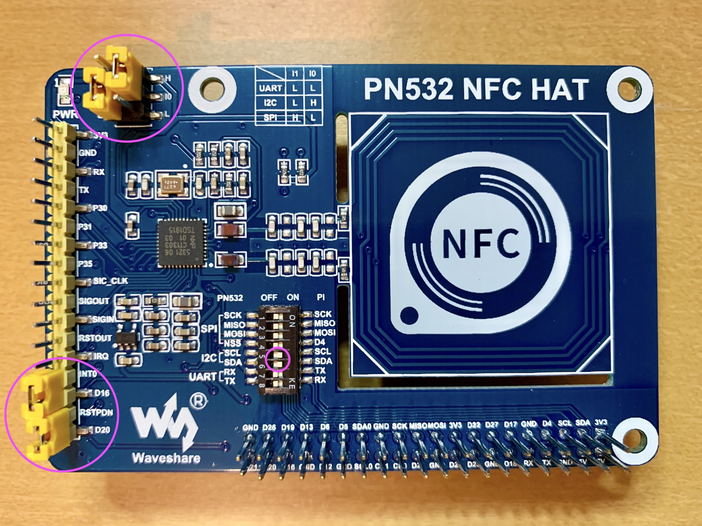
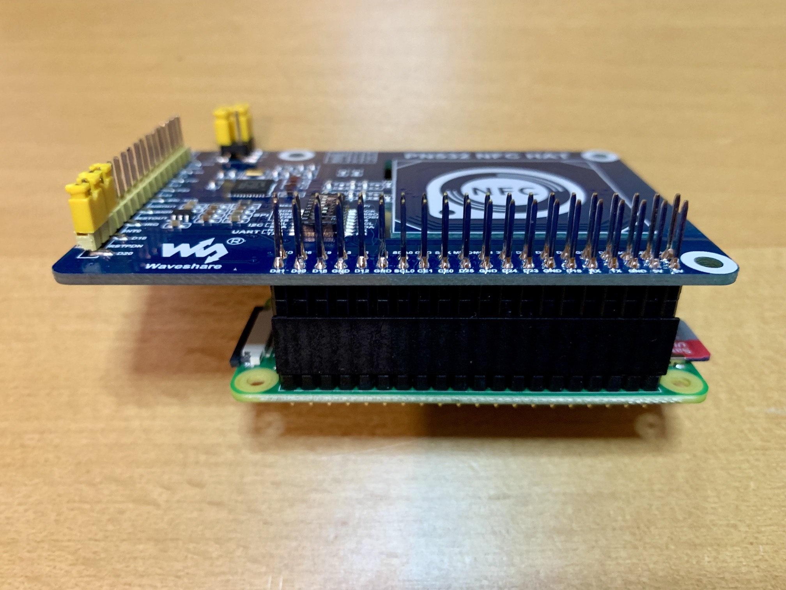

# Waveshare PN532 NFC HAT

**Specifications:**

* Chip: PN532
* Operating frequency: 13.56MHz
* Power supply voltage: 3.3V/5V
* Communication interface: UART (default), SPI, I2C

<br />

Raspberry Pi has 3 types of serial interfaces on its GPIO header, namely UART (Universal Asynchronous Receiver/Transmitter), SPI  (Serial Peripheral Interface) and I2C (Inter-Integrated Cricuit). These serial interfaces allow data exchange/communication between Raspberry Pi and other microcontrollers or peripherals (such as an RFID reader).

The Waveshare PN532 NFC HAT supports all 3 types of serial interfaces, but since Phoniebox expects/requires PN532 module be connected via I2C, we will be setting up the Waveshare PN532 NFC HAT with the I2C interface.

<br />

1. The installation and setup process consists of the following parts:

   1. Configuring your Raspberry Pi
   2. Installing RC522 RFID module
   3. Verifying installation

   You will need:

   * Raspberry Pi with Raspberry Pi OS already installed
   * Display monitor
   * Keyboard

<br />

## Installation

### 1. Configure Raspberry Pi

1. Enable the I2C interface on your Raspberry Pi.

    1. Start the raspi-config tool.

        ```bash
        sudo raspi-config
        ```

    1. Using the Up/Down key, select **Interface Options** and press the **Enter** key.

    1. Using the Up/Down key, select **I2C** and press the **Enter** key.

    1. Using Left/Right key (or the Tab key), select **\<Yes>** to enable the ARM I2C interface and press the **Enter** key.

    1. With **\<Ok>** selected, press the **Enter** key.

    1. Using the Tab key, select **\<Finish>** and press the **Enter** key.

1. Check and confirm I2C has been successfully enabled. 

    ```bash
    lsmod | grep i2c
    ```

    The output of the command should include the following 2 lines:

    ```bash
    i2c_bcm2835            16384  0
    i2c_dev                16384  0
    ```

### 2. Install PN532 NFC HAT on Raspberry Pi

1. Shut down your Raspberry Pi, and when the LED light is turned off, disconnect your Raspberry Pi from the power source.

    ```bash
    sudo shutdown -h now
    ```

1. Check and double-check the PN532 NFC HAT is wired and configured correctly, using the image and checklist provided. 

    :warning: Make sure you do this with the PN532 NFC HAT unmounted/unplugged from your Raspberry Pi.

    

    Checklist:

    - [ ] I1 is connected (shortened) to ‘L’ with a jumper.

    - [ ] I0 is connected (shortened) to ‘H’ with a jumper.

    - [ ] INT0 and D16 are connected (shortened) with a jumper.

    - [ ] RSTPDN and D20 are connected (shortened) with a jumper.

    - [ ] On the DIP switch, only SCL and SDA are turned on and all the others are turned off.

1. Mount/plug the PN532 NFC HAT onto the GPIO pins on your Raspberry Pi. 

    :warning: Make sure you do this with your Raspberry Pi shut down and powered off, i.e. with the power supply not plugged in, just in case you make a mistake when you're mounting the PN532 NFC HAT.

    

1. Check and double-check the connection. Shifting the connection by one pin or down a full row of pins could cause damage to both the PN523 NFC HAT and your Raspberry Pi.

1. Re-connect your Raspberry Pi to a power source and boot it up.

### 3. Verify installation

1. Make sure you are in your HOME directory.

    ```bash
    cd
    ```

1. Make sure your package list is up-to-date.

    ```bash
    sudo apt update
    ```

1. Install dependencies.

    * p7zip-full

      Check if the package is already installed:

      ```bash
      apt list --installed | grep p7zip-full
      ```

      If it is already installed, the command will output like the following (usually after a few seconds' pause):

      ```bash
      p7zip-full/stable,now 16.02+dfsg-8 armf [installed]
      ```

      Otherwise, install the package:

      ```bash
      sudo apt install p7zip-full
      ```
      
    * python3-serial

      Check if the package is already installed:

      ```bash
      apt list --installed | grep python3-serial
      ```

      If it is already installed, the command will output like the following (usually after a few seconds' pause):

      ```bash
      python3-serial/stable,now 3.5-1.1 all [installed]
      ```
      
      Otherwise, install the package:
      
      ```bash
      sudo apt install python3-serial
      ```

1. Create a new directory named `downloads` and change your working directory to it.

    ```bash
    mkdir downloads && cd downloads
    ```

1. Download example code.

    ```bash
    wget https://www.waveshare.com/w/upload/6/67/Pn532-nfc-hat-code.7z
    ```

1. Uncompress the contents of the downloaded 7z (7-zip) file into a new directory named `Pn532-nfc-hat-code`.

    ```bash
    7z x Pn532-nfc-hat-code.7z -oPn532-nfc-hat-code
    ```

    List the content of the `Pn532-nfc-hat-code` directory:

    ```bash
    ls -la Pn532-nfc-hat-code
    ```

    ... which should look like this:

    ```bash
    total 24024
    drwx------ 3 pi pi     4096 Jul 13  2019 arduino
    drwx------ 4 pi pi     4096 Jul 13  2019 raspberrypi
    drwx------ 9 pi pi     4096 Aug 13  2019 stm32
    ```

1. Edit the file `Pn532-nfc-hat-code/raspberrypi/python/example_get_uid.py`.

   ```bash
   nano Pn532-nfc-hat-code/raspberrypi/python/example_get_uid.py
   ```

   Comment the line:

   ```bash
   pn532 = PN532_SPI(debug=False, reset=20, cs=4)
   ```

   Uncomment the line:

   ```bash
   #pn532 = PN532_I2C(debug=False, reset=20, req=16)
   ```

   The edited part should now look like this:

   ```bash
   if __name__ == '__main__':
       try:
       #pn532 = PN532_SPI(debug=False, reset=20, cs=4)   # Comment this line
       pn532 = PN532_I2C(debug=False, reset=20, req=16)  # Uncomment this line for I2C
       #pn532 = PN532_UART(debug=False, reset=20)        # Uncomment this line for UART
       
       ...
   ```

   Press the **Ctrl+X** keys to exit nano (text editor), then type **y** to save changes, and press the **Enter** key to confirm to write to `Pn532-nfc-hat-code/raspberrypi/python/example_get_uid.py`.

1. Run the example code.

    ```bash
    python3 Pn532-nfc-hat-code/raspberrypi/python/example_get_uid.py
    ```

    The code will initially output:

    ```bash
    Found PN532 with firmware version: 1.6
    Waiting for RFID/NFC card...
    ```

    and when the NFC/RFID fob or sticker or card is placed over the area marked `(((•)))`, hexadecimal numbers will start appearing in your terminal window:

    ```bash
    ...........Found card with UID: ['0x1', '0x23', '0x45', '0x67']
    .Found card with UID: ['0x1', '0x23', '0x45', '0x67']
    .Found card with UID: ['0x1', '0x23', '0x45', '0x67']
    .Found card with UID: ['0x1', '0x23', '0x45', '0x67']
    .Found card with UID: ['0x1', '0x23', '0x45', '0x67']
    .Found card with UID: ['0x1', '0x23', '0x45', '0x67']
    .Found card with UID: ['0x1', '0x23', '0x45', '0x67']
    .Found card with UID: ['0x1', '0x23', '0x45', '0x67']
    .Found card with UID: ['0x1', '0x23', '0x45', '0x67']
    .Found card with UID: ['0x1', '0x23', '0x45', '0x67']
    ```

1. Press the **Ctrl+C** keys to quit running the code.

<br /><br />

\---

Michael Donnay and Kunika Kono, [Digital Humanities Research Hub (DHRH)](https://www.sas.ac.uk/digital-humanities), School of Advanced Study (SAS), University of London.  

:octocat: Find us on GitHub at https://github.com/SAS-DHRH